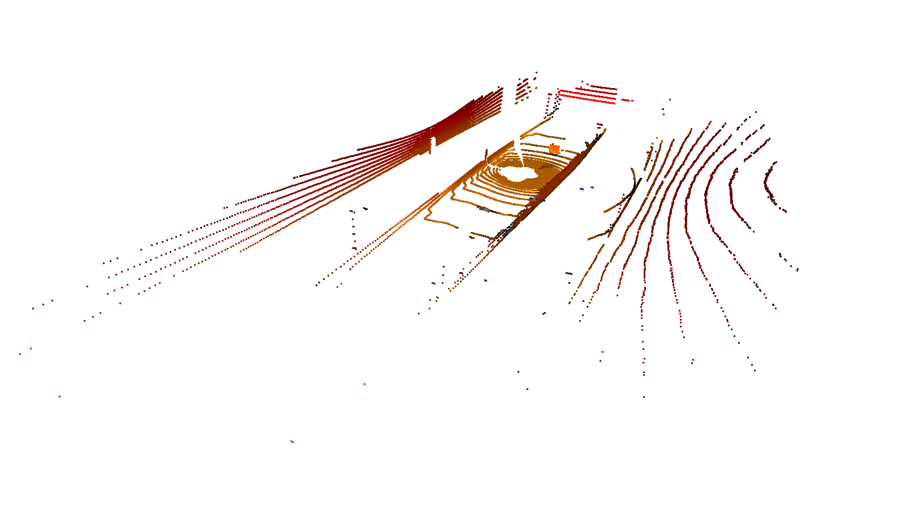
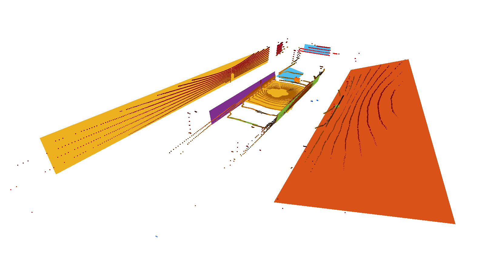

Point Cloud Plane Segmentation
==============================

This library can be used to extract planar patches from unorganized point clouds. It is a stripped-down version of [**@abnerrjo**](https://github.com/abnerrjo)'s Robust Statistics-based Plane Detection (`rspd`) work published as

> AMC Araújo and MM Oliveira, “A robust statistics approach for plane detection in unorganized point clouds,” Pattern Recognition, 2020.

The original implementation and other details can be found on [GitHub](https://github.com/abnerrjo/PlaneDetection) and their [project page](https://www.inf.ufrgs.br/~oliveira/pubs_files/RE/RE.html).

## Look and Feel

When executed on a raw point cloud with 50k points, `rspd` finds 20 planar patches in approximately 120 ms (i9-7920X, 64GB).

<p align="middle">
  
  
</p>

## Build and Run

This library and an example app can be built with the usual

```bash
$ mkdir build && cd build
$ cmake .. && make
```

Using the provided test data, you can run `rspd` on a point cloud with

```bash
$ cd build
$ ./main ../data/blue.pcd
```

### Open3D Dependency

The `master` branch depends on [Open3D](http://www.open3d.org/). If you did not install Open3D system-wide, you will need to provide the `CMAKE_PREFIX_PATH` instead of the `cmake ..` command above

```bash
$ cmake -DCMAKE_PREFIX_PATH=/path/to/Open3D/build/install ..
```

In this case, **Open3D was built from source** after running the `cmake` command

```bash
# Open3D was built from source using
$ cmake -DCMAKE_INSTALL_PREFIX=$(pwd)/install ..
```

## Parameters

| Parameter                            | Default                                 | Description                                                                                                                                                                                                                                    |
|--------------------------------------|-----------------------------------------|------------------------------------------------------------------------------------------------------------------------------------------------------------------------------------------------------------------------------------------------|
| `mMinNormalDiff`                     | 60 degrees                              | A patch's associated point normals are tested against the patch's estimated normal. If the lower bound of the spread of similarity scores (roughly: 3σ below median) is lower than this, the patch is considered not robust and is thrown out. |
| `mMaxDist`                           | 75 degrees                              | A patch's associated points are scored on distance to plane. Smaller values encourage tighter distribution of points around the plane. Also encourages truly planar patches. See Fig 4 of paper.                                               |
| `mOutlierRatio`                      | 0.75                                    | Maximum allowable ratio of outlier points in a given patch's associated point set.                                                                                                                                                             |
| `minNumPoints`                       | 30                                      | Do not subdivide an octree node with less than this number of points                                                                                                                                                                           |
| `nrNeighbors` (normal estimation)    | 75                                      | Number of neighbors used to estimate the normals of each point.                                                                                                                                                                                |
| `nrNeighbors` (knn search)           | 75                                      | Number of neighbors used when attempting to grow and merge patches. More neighbors will result in (potentially) fewer output patches at the expense of more runtime.                                                                           |
| minimum length of longest patch edge | 0.01 * longest dimension of point cloud | In the original code, this parameter is hardcoded. This value is used to detect false positives and may be a valuable knob to tune. Alternatively, area could be used to cull too small planes.                                                |

## Differences with Original Implementation

This implementation only provides the `rspd` functionality for planar patch detection. Additionally, it removes the Qt dependency and uses modern CMake for the build system. The algorithm and default parameters are the same as in [the original](https://github.com/abnerrjo/PlaneDetection).

Although the `master` branch `rspd` library depends on Open3D, the [`rspd-original`](https://github.com/plusk01/pointcloud-plane-segmentation/tree/original-rspd) branch does not (the `rspd` library, though the app used to test / visualize does).
